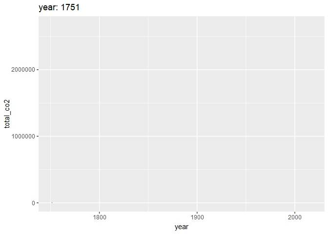
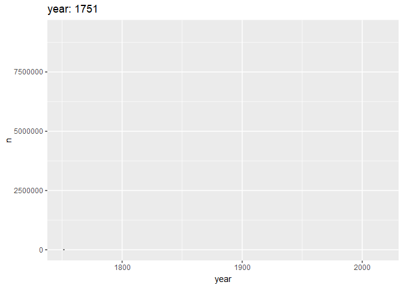

```{r packages-setup, include = FALSE}
library(tidyverse)
library(klippy)  #- remotes::install_github("rlesur/klippy")
library(knitr)
```

```{r chunk-setup, include = FALSE}
knitr::opts_chunk$set(echo = TRUE, eval = TRUE, message = FALSE, warning = FALSE, 
                      #results = "hold",
                      cache = FALSE, cache.path = "/caches/", comment = "#>",
                      #fig.width = 7, #fig.height= 7,   
                      #out.width = 7, out.height = 7,
                      collapse = TRUE,  fig.show = "hold",
                      fig.asp = 7/9, out.width = "60%", fig.align = "center")
knitr::opts_chunk$set(dev = "png", dev.args = list(type = "cairo-png"))
```

```{r options-setup, include = FALSE}
options(scipen = 999) #- para quitar la notación científica
options("yaml.eval.expr" = TRUE) 
```


```{r klippy, echo = FALSE}
klippy::klippy(position = c("top", "right")) #- remotes::install_github("rlesur/klippy")
```

-----------------

Trabajo  elaborado para la asignatura "Programación y manejo de datos en la era del Big Data" de la Universitat de València durante el curso 2020-2021. La página web de la asignatura puede verse aquí: <https://perezp44.github.io/intro-ds-20-21-web/>. Los trabajos de mis compañeros de curso pueden verse [aquí](https://perezp44.github.io/intro-ds-20-21-web/07-trabajos.html).

---------------

<br>

## Introducción {.tabset}

### Objetivos

El objetivo de este trabajo es ...

### Fuente de los datos

Los datos utilizados provienen del [Ministerio del Interior](http://www.infoelectoral.mir.es/infoelectoral/min/areaDescarga.html?method=inicio) ...

### Primeros pasos

Primero importamos las librerias básicas, utilizamos más librerias pero las llamamos cuando las necesitamos. Les remito al `sessionInfo()` para ver todos los paquetes utilizados.

```{r library_setup}
library(tidyverse)
library(sf)
library(viridis)
library(plotly)
library(gganimate)
library(transformr)
library(wordcloud2)
library(janitor)
```

Una vez cargados los paquetes que vamos a utilizar, procedemos a importar los datos que vamos a utilizar

```{r df_base}
# Cargamos df de las elecciones y limpiamos los nombre de los partidos
df_co2<- read_csv("./Datos/nation_1751_2017.csv")
temp_country <-read_csv("./Datos/GlobalLandTemperaturesByCountry.csv")
coast_vs_waste <- readr::read_csv("https://raw.githubusercontent.com/rfordatascience/tidytuesday/master/data/2019/2019-05-21/coastal-population-vs-mismanaged-plastic.csv")

mismanaged_vs_gdp <- readr::read_csv("https://raw.githubusercontent.com/rfordatascience/tidytuesday/master/data/2019/2019-05-21/per-capita-mismanaged-plastic-waste-vs-gdp-per-capita.csv")

waste_vs_gdp <- readr::read_csv("https://raw.githubusercontent.com/rfordatascience/tidytuesday/master/data/2019/2019-05-21/per-capita-plastic-waste-vs-gdp-per-capita.csv")
dco2_pc<- read_csv("./Datos/co2_pc.csv")
```


## Emisionnes de co2, diferentes perspectivas.

...

```{r }
#Limpiamos el df y ponemos las variables como numericas
df_co2_2 <- df_co2[-c(1:4), ]
df_co2_2[ df_co2_2 == "." ] <- NA
 df_co2_3 <-  transform(df_co2_2, X2 = as.numeric(X2),
   X3 = as.numeric(X3),
   X4 = as.numeric(X4),
   X5 = as.numeric(X5),
   X6 = as.numeric(X6),
   X7 = as.numeric(X7),
   X8 = as.numeric(X8),
   X9 = as.numeric(X9),          
   X10 = as.numeric(X10)      
 )
 #comprobamos que las variables del df3 estan correctas
 str(df_co2_3)
 #renombramos las variables para trabajar de manera mas cómoda
             
df_co2_4 <- df_co2_3 %>% rename(country = `Carbon.Dioxide.emissions.from.fossil.fuel.consumption.and.cement.production.by.nation`,
  year = X2,
   total_co2 = X3 #`Total CO2 emissions from fossil-fuels and cement production (thousand metric tons of C)`
   ,
em_sf = X4, #`Emissions from solid fuel consumption` 
em_lf = X5, #`Emissions from liquid fuel consumption` 
em_gf = X6, #`Emissions from gas fuel consumption` 
em_cp = X7, #`Emissions from cement production` ,
em_gfl = X8, #`Emissions from gas flaring`
em_co2_pc = X9, #`Per capita CO2 emissions (metric tons of carbon)`
em_bf = X10 #`Emissions from bunker fuels`
)
#creamos los diferentes df modificados que vamos a usar 
 n_df_0 <- df_co2_4%>% select(year,country,total_co2)%>%  filter(year==2010) %>% group_by(country)%>% select(-year) %>% arrange(total_co2)
  n_df <- df_co2_4 %>% group_by(country) %>% summarise(total_co2=sum(total_co2))%>% ungroup() %>% slice_max(total_co2,n=20) %>% arrange(desc(total_co2))
  n_df2 <- df_co2_4 %>% filter(year > 2000) %>% group_by(country) %>% summarise(em_co2_pc=sum(em_co2_pc))%>% ungroup() %>% slice_max(em_co2_pc,n=40) %>% arrange(desc(em_co2_pc))
  w_df <- df_co2_4 %>% group_by(year) %>% summarise(n=sum(total_co2))%>% ungroup()

```


```{r co2_gf1, message = FALSE, warning = FALSE, results = FALSE}
df_co2_5 <-df_co2_4 %>% group_by(country)
    
    
    
  g<-  df_co2_5 %>% ggplot() +
    geom_line(aes(year,total_co2 ,color = country,group=country) ) +
      theme(legend.position="none")
  
  
  goo <- g +  transition_reveal(year) +
    labs(title = "year: {as.integer(frame_along)}")
  anim_save("goo.gif", goo)


```



```{r co2_gf2, message = FALSE, warning = FALSE, results = FALSE}

  

  o<-  w_df %>% ggplot() +
     geom_line(aes(year,n)) 

 ooo<- o +  transition_reveal(year) +
    labs(title = "year: {as.integer(frame_along)}")
  anim_save("ooo.gif", ooo)
   

```




```{r co2_gf3, fig.height = 4, fig.width = 6, fig.align = "center",dpi = 200}

  #Grafico circular paises con mayor prod. co2 per capita
 # ----- This section prepare a dataframe for labels ---- #
# Get the name and the y position of each label

 n_df3 <- n_df2 %>% mutate(id = seq(1,40))
label_data <- n_df3
# calculate the ANGLE of the labels
number_of_bar <- nrow(label_data)
angle <-  90 - 360 * (label_data$id-0.5) /number_of_bar     # I substract 0.5 because the letter must have the angle of the center of the bars. Not extreme right(1) or extreme left (0)
 
# calculate the alignment of labels: right or left
# If I am on the left part of the plot, my labels have currently an angle < -90
label_data$hjust<-ifelse( angle < -90, 1, 0)
 
# flip angle BY to make them readable
label_data$angle<-ifelse(angle < -90, angle+180, angle)


# Start the plot
p <- ggplot(n_df3, aes(x=as.factor(id), y=em_co2_pc,fill=em_co2_pc)) +       # Note that id is a factor. If x is numeric, there is some space between the first bar
  
  # This add the bars with a blue color
  geom_bar(stat="identity") +
  
  # Limits of the plot = very important. The negative value controls the size of the inner circle, the positive one is useful to add size over each bar
  ylim(-100,400) +
  
  # Custom the theme: no axis title and no cartesian grid
  theme_minimal() +
  theme(
    axis.text = element_blank(),
    axis.title = element_blank(),
    panel.grid = element_blank(),
    plot.margin = unit(rep(-1,4), "cm")      # Adjust the margin to make in sort labels are not truncated!
  ) +
  
  # This makes the coordinate polar instead of cartesian.
  coord_polar(start = 0) +
  
  # Add the labels, using the label_data dataframe that we have created before
  geom_text(data=label_data, aes(x=id, y=em_co2_pc, label=country, hjust=hjust), color="black", fontface="bold",alpha=0.6, size=2.5, angle= label_data$angle, inherit.aes = FALSE ) +
  scale_fill_viridis_c(option = "B", trans = "sqrt")
 
p


```

```{r }


 
  #gráfico mayores productores co2 del mundo(acumulado total)
    
 p<- n_df %>% ggplot(aes(x = reorder(country, total_co2),total_co2,fill= total_co2)) +
    geom_bar(stat = "identity") +
    theme(legend.position = "none") +
    coord_flip()
  p
  
  
  


```

```{r fig.height = 2, fig.width = 7 ,dpi = 150,fig.align = "center"}
#Gráfico paises con mas emisiones de co2

n_df6 <- df_co2_4 %>% group_by(country) %>% summarise(total_co2=sum(total_co2))%>% ungroup() %>% arrange(desc(total_co2))
  
  
      n_df_0$country <- recode(n_df_0$country, 
                          "UNITED STATES OF AMERICA"="USA",
        "CHINA (MAINLAND)"="CHINA",
        "FRANCE (INCLUDING MONACO)"="FRANCE",
        "ITALY (INCLUDING SAN MARINO)"="ITALY",
        "RUSSIAN FEDERATION" = "RUSSIA"
        
        )
  
  wordcloud2(data = n_df_0, size = 0.8
  )


```


